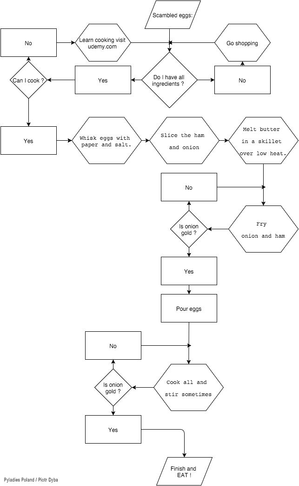

Introduction to Algorithm
=========================

Algorithm is step-by-step set of operations to be performed. Like
cocking recipe.

Example
-------

**Example with Scrambled eggs:**

Ingredients:

-   eggs
-   ham
-   onion
-   butter
-   peper
-   salt

**Recipe:**

In a cup or small bowl, whisk together the eggs, paper and salt using a
fork. Slice the ham and onion into small pieces. Melt butter in a
skillet over low heat. Start frying onion and ham until onion is gold.
Pour in the eggs, and stir constantly as they cook. Cook until desired
consistence, do not over cook.

Step Diagram
------------



Pseudo Code
-----------

```python3
ingredients = eggs, ham, onion, butter, peper, salt
my_ingredients = get(ingredients)
if len(my_ingredients) < ingredients then go shopping
whisk(eggs, peper, salt)
slice(ham)
slice(onion)
while butter.state != 'liquid': melt_using_skillet(butter)
while onion.color != 'gold': fry(onion, ham)
while eggs.state != desired_state: cook_and_stir(all)
eat(all)

eat(all)

```

Exercises
---------

Exercises: Image Fun:

1.  Create team name.
2.  Each TEAM creates random nonopen figure using 4-8 straight lines for
ex. square or octagon on provided paper sheet.
3.  Sign the paper sheet with your team name.
4.  Shuffle all images across all teams.
5.  After receiving an image from other team: create instruction that
will allow another team to recreate the same figure as closely as
possible can be.
6.  Sign the paper sheet with previous team names and add your team
name.
7.  Shuffle only instructions across all teams.
8.  After receiving instruction from other team, process the instruction
and create the image it provides.
9.  Sign the paper sheet with previous team names and add your team
name.

Lets compare the images with originals, instructions. Think about the
differences and why did they happen.

Deaf phone:

1.  Each team creates random sentence max 20 characters.
2.  Sign the paper sheet with your team name.
3.  Shuffle all sentence across all teams.
4.  Each team creates an encoding (ciphering) algorithm. Not more then 6
steps.
5.  Using the algorithm encode the received sentence and write the
secret message on paper with encoding algorithm.
6.  Sign the paper sheet with previous team names and add your team
name.
7.  Shuffle all encoded sentence with encoding mechanism across all
teams.
8.  Each team decodes the sentence and writes down the decoding
algorithm on a new sheet of paper.
9.  Write down the given encoded sentence on decoding algorithm paper
10. Sign the paper sheet with previous team names and add your team
name.
11. Each team decodes the sentence.
12. Sign the paper sheet with previous team names and add your team
name.
13. Now lets see if the sentences matches ? What have happened to them ?

Can You now feel how useful is to use algorithm and how often do You use
them

