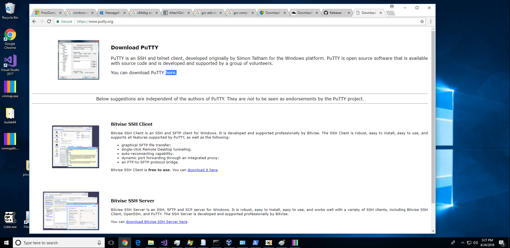
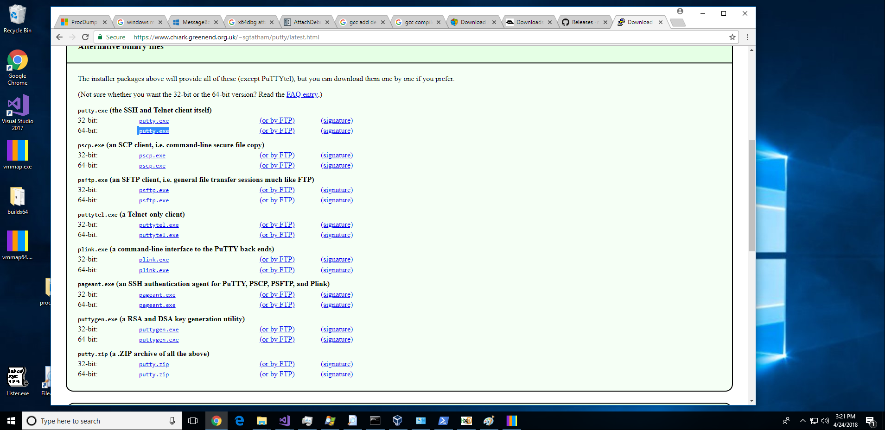
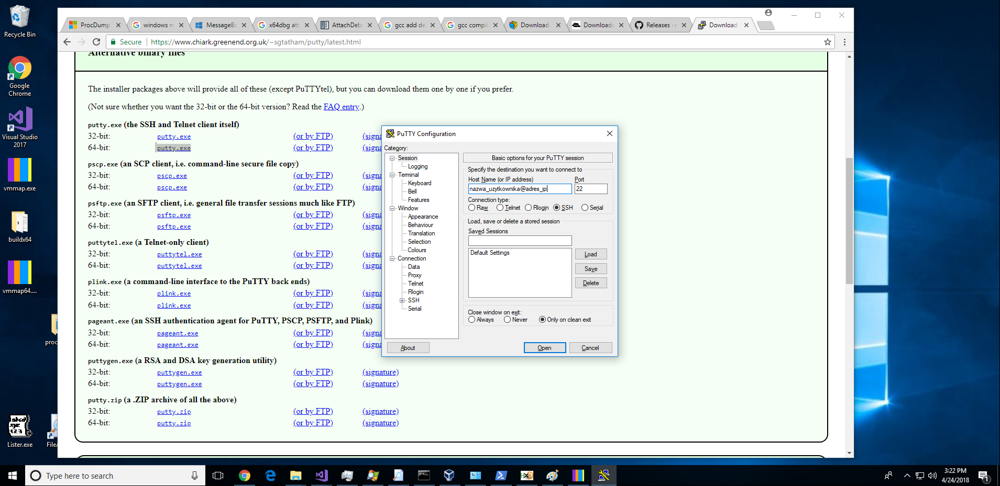

1.22 Deployment aplikacji webowej
=================================

Serwer WWW
----------

Do tej pory, kiedy uruchamialiśmy aplikacje webowe napisane we Flasku, używaliśmy polecenia:

    :::python3
    app.run()

W rzeczywistości powoduje ono uruchomienie tak zwanego **serwera WWW**. Serwer WWW to aplikacja, której zadaniem jest
przyjmowanie i obsługa zapytań HTTP. W większości przypadków, z którymi mieliśmy do czynienia do tej pory,
serwer przekazywał zapytania do naszej aplikacji, która zajmowała się np. pobraniem danych z bazy i wygenerowaniem
strony HTML, będącej właściwą odpowiedzią na dane zapytanie. W rzeczywistości wiele zapytań może nie wymagać
przekazania ich do samej aplikacji, przykładowo:
- zapytania o pliki statyczne (obrazki, pliki CSS, JavaScript) - takie pliki są przekazywane bez żadnych zmian
jako odpowiedź do klienta (przeglądarki), więc nie ma sensu, żeby były przetwarzane przez naszą aplikację;
- zapytania, które wymagają długiego przetwarzania mogą być cachowane po stronie serwera WWW - jeśli takie samo
zapytanie pojawi się kilka razy, serwer może wykorzystać odpowiedź z cache'u bez kontaktowania się z aplikacją.

Serwery WWW mają też różne inne możliwości, między innymi:
- uwierzytelnianie - możemy wymagać, aby dostęp do całej aplikacji wymagał podania nazwy użytkownika i hasła,
dzięki temu nie musimy implementować tego mechanizmu w aplikacji (uwaga - po stronie serwera możemy zabezpieczyć
dostęp tylko do całej aplikacji - jeśli chcemy np. mieć różne uprawnienia dla użytkowników, musimy to zaimplementować sami);
- HTTPS - serwer WWW może sprawić, że nasza aplikacja będzie dostępna tylko po protokole szyfrowanym, nawet jeśli
sama aplikacja nie posiada obsługi HTTPS;
- proxy - bardzo przydatne, jeśli chcemy, aby niektóre zapytania były przekazywane do innej aplikacji (przykładowo
zapytania typu `mojastrona.pl/frontend.html` mogą trafiać do aplikacji udostępniającej frontend naszej strony,
a zapytania typu `mojastrona.pl/api/dane` do aplikacji, zawierającej backend strony).
- serwer WWW stosujemy również do serwowania stron statycznych (tylko HTML, CSS, ew. JavaScript - nie posiadających
backendu, służących tylko do wyświetlania informacji).

Serwer, który uruchamiamy poleceniem `app.run()` to serwer deweloperski, który nie powinien być stosowany, kiedy
uruchamiamy aplikację produkcyjnie (udostępniamy dla użytkowników). Z dokumentacji Flaska:

    Do not use run() in a production setting.
    It is not intended to meet security and performance requirements for a production server.

Aby uruchomić aplikację produkcyjnie, powinniśmy skorzystać z innego, dedykowanego serwera.

### Flask i serwer WWW

Istnieje wiele serwerów WWW, przykładowo:
- Apache
- nginx
- Gunicorn
- uWSGI

Aby uruchomić aplikację napisaną we Flasku (podobnie jak w większości pythonowych frameworków), serwer musi
obsługiwać protokół **WSGI**. Jedną z najprostszych opcji jest użycie uWSGI (niestety działa tylko na Linuksie):

    :::bash
    pip install uwsgi

Załóżmy, że mamy następującą aplikację (plik `myapp.py`):

    :::python3
    from flask import Flask

    app = Flask(__name__)
    
    @app.route("/add/<int:liczba1>/<int:liczba2>")
    def add(liczba1, liczba2):
        return str(liczba1 + liczba2)
    
    if __name__ == '__main__':
        app.run(debug=True)

Aby uruchomić aplikację przez uWSGI, będziemy potrzebować plik konfiguracyjny `uwsgi.ini`:

    :::ini
    [uwsgi]
    http = 0.0.0.0:8000
    wsgi-file = myapp.py
    callable = app

Następnie uruchamiamy aplikację poleceniem:

    :::bash
    uwsgi --ini uwsgi.ini

Teraz możemy w przeglądarce wejść np. na adres `127.0.0.1:8000/add/2/3`.

Możemy skonfigurować uWSGI tak, żeby aplikacja uruchamiała się w tle. Służą do tego następujące opcje:
- `daemonize = <nazwa pliku, do którego trafią logi serwera>`
- `pidfile = <nazwa pliku, do którego trafi id procesu, w którym zostanie uruchomiony serwer>`
- `master = True` - powoduje, że serwer będzie posiadał proces nadrzędny, co pozwala np. na eleganckie restartowanie

Kod do zadania 2.

    :::python3
    import time
    
    from flask import Flask
    
    app = Flask(__name__)
    
    @app.route("/add/<int:liczba1>/<int:liczba2>")
    def add(liczba1, liczba2):
        return str(liczba1 + liczba2) + '\n'
    
    @app.route("/long")
    def long():
        time.sleep(10)
        return 'done\n'
    
    if __name__ == '__main__':
        app.run(debug=True)

### nginx

Nginx to serwer WWW, który sam w sobie nie jest stosowany do serwowania aplikacji WSGI, ale jest bardzo często
wykorzystywany do zadań takich jak proxowanie, uwierzytelnianie czy HTTPS.

- Instalacja: `sudo apt-get install nginx`
- Uruchomienie: `systemctl start nginx`
- Restart: `systemctl restart nginx`

Pliki z konfiguracjami dla nginxa znajdują się w folderze `/etc/nginx/conf.d`. Domyślnie znajduje się tam plik
`default.conf` - można go wyłączyć zmieniając rozszerzenie np. na `tmp`. Następnie dodajemy tam nowy plik - `myapp.conf`:

    :::
    server {
        listen       80;
        server_name  localhost;
    
        location /myapp/ {
            proxy_pass http://127.0.0.1:8000/;
        }
    }

Taka konfiguracja oznacza, że nginx będzie słuchał na porcie 80 - domyślnym porcie HTTP - i wszystkie zapytania
o ścieżce zaczynającej się od `myapp` (np. `127.0.0.1/myapp/add/1/2`) będą przekierowywane (proxowane) do adresu
`127.0.0.1:8000/` - np. `127.0.0.1:8000/add/1/2`. Jeśli nadal mamy uruchomioną naszą aplikację, możemy przetestować
działanie konfiguracji w przeglądarce.

Cloud Computing
---------------

Oczywiście sam kod aplikacji nie wystarczy, żeby udostępnić ją użytkownikom - potrzebujemy jeszcze serwera, na którym
aplikacja mogłaby działać. Ostatnio coraz większą popularność zyskuje Cloud Computing - przetwarzanie w chmurze,
co oznacza, że zamiast kupować i konfigurować własne serwery, korzystamy z zasobów udostępnianych przez dostawców
usług typu Cloud. Najbardziej znane i rozbudowane platformy to Amazon Web Services i Microsoft Azure. Pozwalają
one m.in. na:
- przechowywanie plików,
- tworzenie maszyn wirtualnych dostępnych przez Internet,
- tworzenie baz danych,
- tworzenie wirtualnych sieci,
- etc., etc.

My przyjrzymy się usłudze OpenShift - mniej rozbudowanej, za to dostępnej za darmo dla indywidualnych użytkowników.
Adres: [https://www.openshift.com/](https://www.openshift.com/)

Kilka uwag odnośnie deployowania swoich aplikacji:
- Można deployować tylko z repozytorium Git (np. z GitHuba) - nie ma możliwości wrzucenia kodu np. z dysku.
Jeśli nie pracujesz nad żadnym z projektów możesz użyć przykładowego repozytorium dostępnego w OpenShifcie.
- Aplikacja musi być uruchamiana z pliku `app.py`. Jeśli plik nazywa się inaczej można dodać w OpenShifcie zmienną
środowiskową `APP_FILE`, kórej wartość będzie ustawiona na właściwą nazwę pliku.
- Aplikacja musi słuchać na adresie `0.0.0.0` i porcie `8080` (`app.run('0.0.0.0', 8080)`)

Windows i SSH, czyli PuTTY
--------------------------

Jeśli chodzi o SSH, najczęściej używanym narzędziem dla systemu Windows jest [Putty](https://www.putty.org/).

Aby go pobrać, wejdźmy na wspomnianą wyżej stronę i przejdźmy do pobierania poprzez odnośnik obok *You can download PuTTY*. Wybierając odpowiednią opcję (patrz: zrzut ekranu poniżej) pobierz plik *putty.exe* (w odpowiednim wariancie: 32- lub 64-bitowy) i uruchom. W otwartym oknie w miejscu *Host Name (or IP address)* podaj wymagane dane w formacie *nazwa_użytkownika@adres_ip* (spójrz na kolejny zrzut ekranu). Po kliknięciu "Open" powinno zostać nawiązane połączenie. W wypadku pytania o kontynuowanie podłączenia wpisujemy "yes" i zatwierdzamy Enterem.

